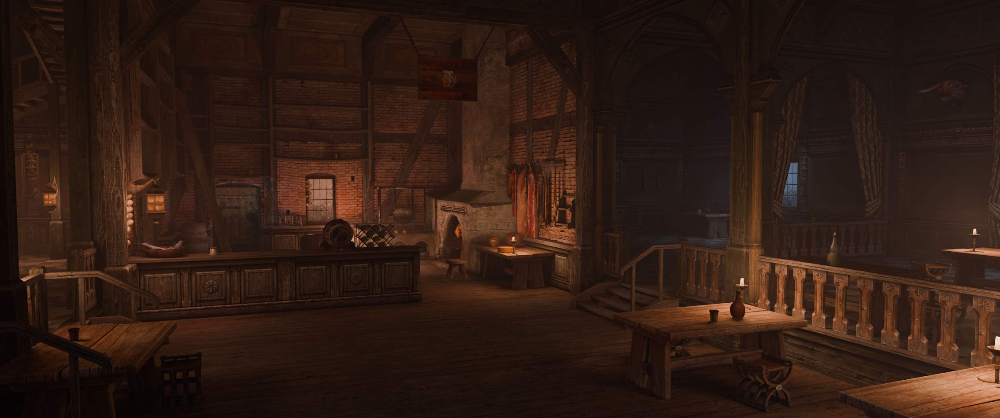
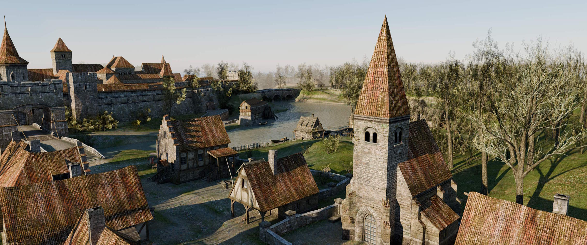
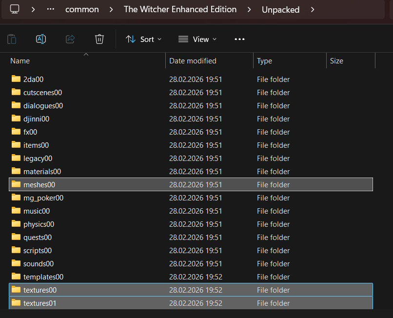
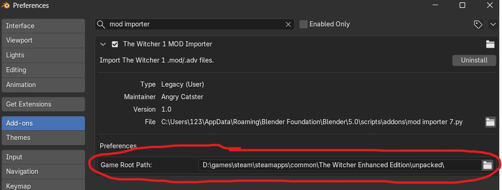

# TheWitcher_blender_level_importer

This is a couple of blender addons to parse and import The witcher binary model format (.mdb) files and adventure module (.adv, .mod) files into the Blender.

Supports blender 5.0.1. Might not be compatible with other versions.

## The MDB importer

It imports:

1. Trimesh nodes (just normal geometry)
2. Skin nodes (used for animated characters) with bones and weights. Still quite WIP
3. Light nodes (AuroraLight light sources)
4. TexturePaint nodes (mostly terrain meshes, consisting of multiple textures blending into each other)
5. SpeedTrees (the vast majority of the game's vegetation is SpeedTrees)
6. LightMaps for different times of day (lighting data baked into a texture)
7. Water bodies (you might want to play around with the alpha value if the water is too transparent/opaque)

## The ADV/MOD importer

These files store positions for the objects placed on the map. The main campaign files are stored in a .mod format (inside your "Data\\modules\\!Final" folder), while all other modules are in an .adv format. There is no difference between them beside the name.

It imports:
1. Placeables (tables, barrels, bottles, candles and so on)
2. Action Placeables (npcs can interact with them - chairs, stools, bedrolls...)
3. Doors (both interactable and non-interactable)
4. Skybox with clouds and sun/moon depending on the selected time of day (a bit wonky, but nothing that can't be fixed manually in a few seconds)

## Setup:
1. Download both plugins and install them as blender addons
2. Download [Spt2Fbx](https://github.com/VenoMKO/Spt2Fbx/releases/),  put "SpeedTreeRT.dll" and "Spt2Fbx.exe" from the archive into your blender folder (where blender.exe is). Just leave them here.
3. UnBIF your game installation (I use and recommend [RedTools](https://github.com/JLouis-B/RedTools/releases)). The addons expect the unpacked directory to look like this:

4. The ADV/MOD importer requires you to set the root directory in its preferences. We created that directory in the previous step.

4. Done! Now use File->Import->Witcher MDB (.mdb) to import individual mdb models or File->Import->Witcher MOD (.mod, .adv) to import entire areas at once.

The .mdb files are inside the "The Witcher Enhanced Edition\Unpacked\meshes00" folder

The .mod files are inside the "The Witcher Enhanced Edition\Data\modules\\!Final" folder

The .adv files are usually inside the "C:\Users\Public\Documents\The Witcher" folder

## Problems and TODO:
1. The scale for the TexturePaint mesh UVs is incorrect. Currently they are just scaled by 50 times, which looks fine for the most maps and objects, but not for the caves (set the "scale" on the "mapping" node to 1 for such meshes).
2. Animation support? I've managed to make it read the .mba file and extract an animation from it, but the bone rotations and orientations were incorrect, turning Geralt into a disfigured abomination. Body horror at its finest.
3. Lots and lots of code clean up. Most of the stuff was vibecoded, which is why I've managed to create these addons in just a couple of weeks worth of free time instead of months/years (I have very little coding experience). Mind you, the code is fast and does what it is supposed to do 99% of the time, it's just ugly if you decide to actually read through it.

## Credits:
1. [DrMcCoy](https://github.com/DrMcCoy) and all the contributors behind the [xoreos](https://github.com/xoreos/xoreos). None of this would be possible without the existence of this project. The amount of info along with the functional code for reading .mdb, .mod(.git, .are) was invaluable in understanding the formats. They also have a cool blog, where the author documented his journey through supporting all aurora engine games inside xoreos, including [The Witcher](https://xoreos.org/blog/2015/04/12/the-witcher-models-and-areas/).
2. [JLouis-B](https://github.com/JLouis-B) for creating [RedTools](https://github.com/JLouis-B/RedTools).
3. Michael_DarkAngel for creating [twMax](https://www.moddb.com/games/the-witcher/downloads/twmax-v1232-mdb-importer-for-3dsmax) plugin.
4. [Fantasta](https://www.nexusmods.com/profile/Fantasta) for [.mdl exporter](https://www.nexusmods.com/witcher/mods/122).
5. [VenoMKO](https://github.com/VenoMKO) for [Spt2Fbx](https://github.com/VenoMKO/Spt2Fbx).
6. DeepSeek I suppose. I wouldn't be able to write the plugins of such complexity otherwise.
